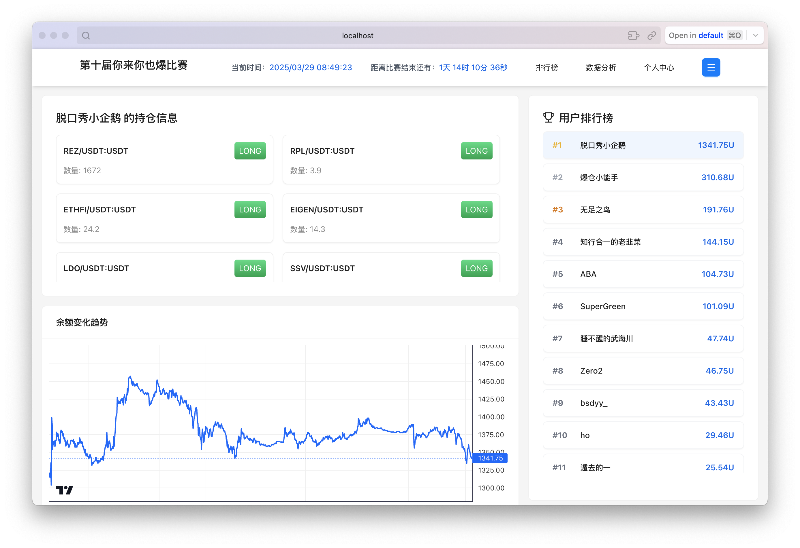

# Jumbo 项目

这是一个由两个主要部分组成的项目：前端排名展示系统和后端 Python SQLite 服务器。

## 项目结构

```
jumbo/
├── react-ranking-page/    # React 前端项目
└── server/              # Python SQLite 后端服务
```

## 启动说明

⚠️ 重要：必须先启动后端服务，再启动前端项目。

### 1. 后端服务 (server)

1. 进入后端项目目录：
```bash
cd server
```

2. 创建并激活 conda 环境：
```bash
conda create -n sqlite_server python=3.10
conda activate sqlite_server
```

3. 安装依赖：
```bash
pip install -r requirements.txt
```

4. 启动服务器：
```bash
python app.py
```

后端服务将会启动并连接到 SQLite 数据库。确保服务器正常运行后，再进行下一步。

### 2. 前端项目 (react-ranking-page)

1. 打开新的终端窗口，进入前端项目目录：
```bash
cd react-ranking-page
```

2. 安装依赖：
```bash
npm install
```

3. 启动项目：
```bash
npm start
```

前端服务将会在 3000 端口启动 (http://localhost:3000)。

## 系统要求

- Python 3.10
- Conda（推荐使用）
- Node.js 和 npm（前端）

## 注意事项

- 必须确保后端服务已经完全启动并正常运行，再启动前端项目
- 确保所有必要的 Python 依赖已正确安装
- 数据库文件将在首次运行时自动创建
- 建议使用两个独立的终端窗口分别运行后端和前端服务


## 交易面板展示


