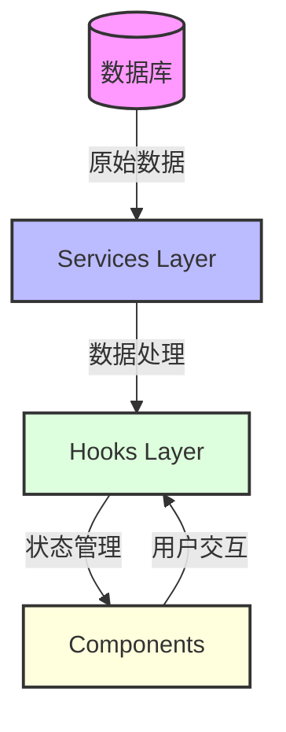
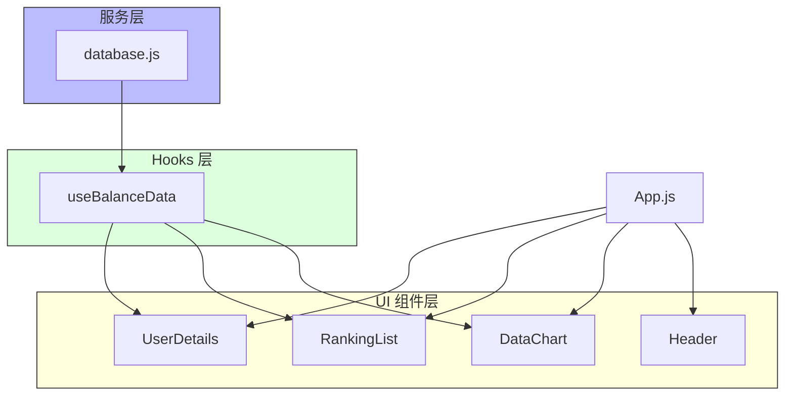

# 🏆 React 排行榜应用

这是一个使用 React 构建的排行榜展示应用，用于显示用户数据统计和排名信息。让数据展示更加生动有趣！ ✨

## 📁 项目结构

```
src/
├── components/          # 可复用组件
│   ├── DataChart.js    # 数据图表组件
│   ├── RankingList.js  # 排行榜列表组件
│   ├── UserDetails.js  # 用户详情组件
│   └── Header.js       # 页面头部组件
├── hooks/              # 自定义 Hooks
│   └── useBalanceData.js  # 数据处理和状态管理 Hook
├── services/           # 服务层
│   └── database.js     # 数据库交互服务
├── containers/         # 页面容器组件
├── App.js             # 应用主组件
└── index.js           # 应用入口文件
```

### 🔄 数据流动图



### 🏗️ 组件架构



## 🚀 核心功能组件

### 组件说明

1. 📊 **DataChart 组件**
   - 负责数据可视化展示
   - 使用图表展示用户数据统计
   - 支持多种数据展示模式

2. 🏅 **RankingList 组件**
   - 展示用户排行榜
   - 支持排序和筛选功能
   - 响应式列表设计

3. 👤 **UserDetails 组件**
   - 显示用户详细信息
   - 支持用户数据编辑
   - 包含用户统计信息

4. 🎯 **Header 组件**
   - 页面导航和标题
   - 全局操作按钮
   - 用户状态显示

## ⚙️ 数据管理

1. 🎣 **Custom Hooks**
   - useBalanceData: 处理用户余额数据
   - 实现数据获取和状态管理
   - 提供数据更新方法

2. 🔌 **服务层**
   - database.js: 处理数据库操作
   - 提供数据 CRUD 接口
   - 实现数据持久化

## 💻 开发指南

### 🔧 安装依赖
```bash
npm install
```

### 🚀 启动开发服务器
```bash
npm start
```

### 📦 构建生产版本
```bash
npm run build
```

### 🧪 运行测试
```bash
npm test
```

## 🛠️ 技术栈

- ⚛️ React 18
- 🎣 React Hooks
- 🎨 CSS Modules
- ✨ Modern JavaScript (ES6+)


## 📜 许可证

MIT License
